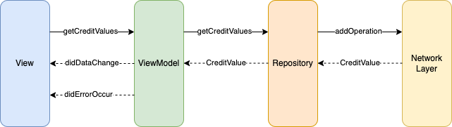

# ClearScoreTechnicalTask

It is a technical task from ClearScore. In this task, a circular progress view is used to display the credit score of a user. The credit information will be retrieved from an API.

## Architecture Design

#### View

- All the logics related to UI and UX design will be in this class e.g. background color, animation etc.

#### ViewModel

- All the business logics will be in this class included getting data from either the network or the cache

#### Repository

- In this class, it will manages the data. For example, the data is from the cache or from the network or to get all the fields of a data, more than one APIs may need to be called

#### Network Layer

- In this layer, it will manage all logics related to calling an API. For example, how many current network calls are allowed at the same time, contructing an absolute URL and the post body etc.

## TODO

- Add pull to refresh to refresh the data, so that the user can refresh to get the latest data easily
- Use NSLocalizedString for all the hardcoded strings
